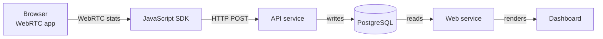

Peermetrics is made up of three components that each handle a distinct part of the monitoring pipeline.

## Components

<Columns cols={3}>
  <Card title="JavaScript SDK" icon="js" href="https://github.com/peermetrics/sdk-js">
    Runs in the browser. Collects WebRTC stats from `RTCPeerConnection` and sends them to the API service. Supports Livekit, Mediasoup, Janus, and custom WebRTC implementations.
  </Card>
  <Card title="API service" icon="server" href="https://github.com/peermetrics/api">
    Receives metrics from the SDK over HTTP, validates them, and writes them to PostgreSQL. Exposed as `peermetrics/api` on Docker Hub.
  </Card>
  <Card title="Web service" icon="chart-line" href="https://github.com/peermetrics/web">
    Reads stored metrics from PostgreSQL and serves the visualization dashboard. Exposed as `peermetrics/web` on Docker Hub.
  </Card>
</Columns>

| Component | Repository | Role |
|-----------|-----------|------|
| JavaScript SDK | [peermetrics/sdk-js](https://github.com/peermetrics/sdk-js) | Collects metrics from client browsers |
| API service | [peermetrics/api](https://github.com/peermetrics/api) | Ingests and persists metrics |
| Web service | [peermetrics/web](https://github.com/peermetrics/web) | Visualizes metrics in the dashboard |

## Data flow

Metrics travel from the browser to the dashboard in four steps:

1. The **JavaScript SDK** polls `RTCPeerConnection.getStats()` and listens for connection events inside your WebRTC application.
2. It batches and sends that data to the **API service** over HTTP.
3. The **API service** validates the incoming data and writes it to **PostgreSQL**, using Redis for session handling and rate limiting.
4. The **Web service** queries PostgreSQL and renders the results in the dashboard UI.

## Why API and web are separate services

The API service and web service are intentionally deployed as separate containers. They have different scaling characteristics:

- The **API service** scales with the number of concurrent calls and participants — it receives a continuous stream of metrics from every active client.
- The **Web service** scales with the number of dashboard users — typically your engineering or operations team.

Separating them lets you scale each service independently based on actual load rather than provisioning both for the same peak.

## Tech stack

Both the API and web services share the same backend stack:

| Layer | Technology |
|-------|------------|
| Language | Python 3.8 |
| Framework | Django |
| Database | PostgreSQL |
| Cache / sessions | Redis |
| Server-side templates | Jinja2 |
| Frontend | VueJS |

## What Peermetrics monitors

The JavaScript SDK collects the following types of data from each WebRTC session:

- **Connection stats** — bitrate (audio and video), packet loss, jitter, round-trip time, and available bandwidth
- **ICE events** — candidate gathering, connectivity checks, and ICE state transitions
- **Peer connection lifecycle** — signaling state changes, connection state changes, and disconnection events
- **Track events** — media track addition, removal, and mute/unmute actions
- **Device information** — browser, operating system, and platform
- **Geographic data** — approximate location derived from IP
- **Automatically detected issues** — Peermetrics flags anomalies such as high packet loss, poor bitrate, and failed connections without requiring manual threshold configuration

All collected data is stored in your own PostgreSQL instance. Nothing is sent to external servers.
